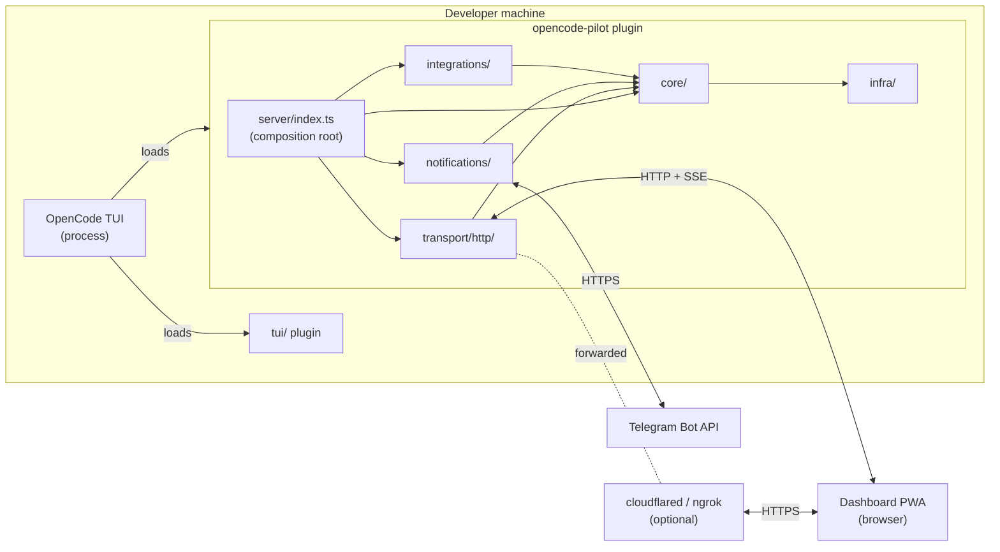

# Architecture

opencode-pilot is an OpenCode plugin that adds a remote-control layer on top of the OpenCode SDK. It exposes sessions, prompts, permissions, and live events over HTTP + Server-Sent Events so you can monitor and drive OpenCode from a phone, another machine, or a public URL — without changing how OpenCode itself works.

**Current version:** v1.18.0. The internal structure was fully reorganized in this version — see `docs/REFACTOR-2026-04-architecture.md` for the full migration history and rationale.

---

## Top-level modules

The `src/` tree is organized as **Screaming Architecture** — folder names announce what the system does, not what technology it uses.

| Module | Purpose | May import from |
|---|---|---|
| `infra/` | Reusable technical plumbing (tunnel, QR, logger, paths, auth token, circuit-breaker, dotenv) | NOTHING (absolute bottom) |
| `core/` | Pure domain rules: sessions, permissions, events, audit, settings, state | `infra/` only |
| `transport/` | How the outside world talks to the core (today: HTTP only) | `core/`, `infra/` |
| `integrations/` | Each external CLI agent (opencode, codex) is a closed module with its own wiring API | `core/`, `infra/`, `transport/` (via `AgentIntegration` port) |
| `notifications/` | Fan-out to outbound channels (telegram, push, future: slack, discord) | `core/`, `infra/` |
| `dashboard/` | Browser SPA served by `transport/http/` | NOTHING (browser runtime, no backend imports) |
| `tui/` | TUI plugin that registers slash-commands in OpenCode | `core/`, `infra/` |
| `cli/` | `opencode-pilot init` binary | `infra/` |
| `server/` | **Façade** — the composition root; the only file allowed to import across all layers | EVERYTHING |

---

## Dependency rule (precise)

```
infra/ ← core/ ← (transport/, integrations/, notifications/) ← server/index.ts
```

- **`infra/` is the absolute bottom.** No project-internal imports.
- **`core/` imports only from `infra/`.** This lets domain logic (permissions, audit, state) use filesystem helpers without dragging in HTTP, Telegram, or Codex.
- **`transport/`, `integrations/`, and `notifications/` import from `core/` and `infra/`.** Cross-imports between siblings (e.g., `transport/ → notifications/`) are FORBIDDEN except through the two explicit ports below.
- **`server/index.ts` is the only file that imports across all layers.** It is the composition root by definition — standard hexagonal/clean architecture.

This rule is enforced by convention (documented here, in `AGENTS.md` §3, and in code review). If violations recur, mechanical enforcement via `eslint-plugin-import/no-restricted-paths` is the natural next step.

---

## Two explicit ports

Ports are interfaces defined where there are multiple implementations and likely future growth. All other capabilities have a single implementation each — their factory function `create*(): T` already serves as the contract without a separate interface.

### `NotificationChannel` — `src/notifications/ports.ts`

```ts
export interface NotificationChannel {
  readonly name: string          // 'telegram' | 'push' | 'slack' | ...
  readonly enabled: () => boolean
  readonly send: (event: NotificationEvent) => Promise<NotificationResult>
}

export type NotificationEvent = {
  kind:
    | 'permission.pending'
    | 'permission.resolved'
    | 'tool.completed'
    | 'session.idle'
    | 'session.error'
  payload: Record<string, unknown>
}
```

`enabled()` is a function (not a property) so runtime config changes via the dashboard settings store activate/deactivate channels without restart.

Implementations: `notifications/channels/telegram/index.ts`, `notifications/channels/push/index.ts`.

### `AgentIntegration` — `src/integrations/ports.ts`

```ts
export interface AgentIntegration {
  readonly name: string          // 'opencode' | 'codex' | 'cursor' | ...
  readonly setup: (deps: IntegrationDeps) => IntegrationHandle
}

export type IntegrationDeps = {
  permissions: PermissionQueue
  events: EventBus
  audit: AuditLog
  registerRoute?: (route: RouteSpec) => void   // Codex uses this
  registerHook?: (event: string, handler: HookFn) => void  // future use
}
```

The composition root passes `registerRoute` only to integrations that need HTTP; `registerHook` only to integrations that are native SDK plugins.

Implementations: `integrations/opencode/index.ts`, `integrations/codex/index.ts`.

---

## Composition root — `src/server/index.ts`

The composition root is the only file that crosses all layers. It is organized in 7 named sections:

```
0. ENV + CONFIG      loadDotEnv, loadConfigSafe, mergeStoredSettings, resolveSources
1. CORE              getSharedEventBus (singleton), createPermissionQueue, createAuditLog, createSettingsStore
2. NOTIFICATIONS     createPushService → push subsystem, createTelegramChannel, createNotificationService
3. STATE + BANNER    generateToken, startTunnel, writeBanner, writeState lifecycle
4. TRANSPORT         createRemoteServer({ permissions, events, audit, settings, push, config, token })
5. INTEGRATIONS      opencodeIntegration.setup, codexIntegration.setup (self-registers /codex routes)
6. START             server.start() — primary/passive port-binding with promotion watcher
7. PLUGIN HANDLE     return { event, permission.ask, tool.execute.before, tool.execute.after }
```

**Shutdown order** (per spec): `opencode.shutdown()` + `codexHandle.shutdown()` → `server.stop()` → `tunnel.stop()` → `notifications.flush()` → `clearState()`.

---

## Recipes

### How to add a new agent CLI integration (e.g., Cursor)

1. Create `src/integrations/cursor/index.ts`:

```ts
import type { AgentIntegration } from '../ports'

export const cursorIntegration: AgentIntegration = {
  name: 'cursor',
  setup: ({ permissions, events, audit, registerRoute }) => {
    registerRoute!({
      method: 'POST',
      pattern: /^\/cursor\/hooks\/(?<event>[^/]+)$/,
      auth: 'none',
      handler: async (ctx) => { /* ... */ },
    })
    return { shutdown: async () => {} }
  },
}
```

2. Add ONE line in `src/server/index.ts`:

```ts
const cursor = cursorIntegration.setup({ permissions, events, audit, registerRoute: server.registerRoute })
// and in shutdown: await cursor.shutdown()
```

Zero changes to `transport/`, `core/`, `notifications/`, or any other file.

### How to add a new notification channel (e.g., Slack)

1. Create `src/notifications/channels/slack/index.ts`:

```ts
import type { NotificationChannel } from '../../ports'

export function createSlackChannel(config: SlackConfig | null): NotificationChannel {
  if (!config) {
    return { name: 'slack', enabled: () => false, send: async () => ({ ok: true }) }
  }
  // ... implementation
  return { name: 'slack', enabled: () => true, send: async (event) => { /* ... */ } }
}
```

2. Add ONE line in the composition root:

```ts
channels: [createTelegramChannel(...), push.channel, createSlackChannel(config.slack)]
```

Zero changes to `pipeline.ts`. Zero changes to `core/`. The port does the work.

---

## Web Push subsystem (special case)

Web Push has three concerns beyond a fire-and-forget channel:

1. **VAPID key management** — `POST /settings/vapid/generate` creates a key pair
2. **Subscription registration** — browsers POST subscription objects for storage
3. **Fan-out sending** — the actual channel behavior

These are bundled in `notifications/channels/push/service.ts` (`createPushService`), which returns a rich object. The composition root extracts `push.channel` for the notification pipeline and passes the full `push` service into the HTTP server so the settings handler can call `push.generateVapid()` and `push.addSubscription()` via dependency injection — no direct `transport/ → notifications/` import.

---

## System diagram



---

## Security model

- **Auth token** — `crypto.randomBytes(32).toString("hex")` — 64 hex chars generated at startup. Rotatable via `POST /auth/rotate`. Persisted in `pilot-state.json` only for the TUI to display.
- **Bearer scheme** — every `auth: "required"` route checks `Authorization: Bearer <token>`. `/events` also accepts `?token=` because `EventSource` cannot set custom headers.
- **Localhost by default** — `PILOT_HOST=127.0.0.1`. Exposed to LAN/internet only when `PILOT_TUNNEL` is set.
- **Audit log** — every authed request, every permission decision, every SSE connection appended as JSON Lines to `.opencode/pilot-audit.log`.
- **Path traversal guard** — static dashboard handler rejects paths containing `..`.
- **Primary/passive promotion** — if port 4097 is taken (multiple OpenCode windows), the second instance runs passive (no HTTP, no tunnel) and auto-promotes when the primary exits.

---

## References

- `docs/REFACTOR-2026-04-architecture.md` — full spec for the v1.18.0 architecture migration (6 atomic commits + JD remediation), with design decisions, risk analysis, and per-commit acceptance gates.
- `src/server/index.ts` — the composition root; live wiring of all 8 modules.
- `AGENTS.md` §3 — hard conventions (dependency rule, factory pattern, test co-location).
- `AGENTS.md` §4 — release process (the three-version-bump rule, tag/push order).
