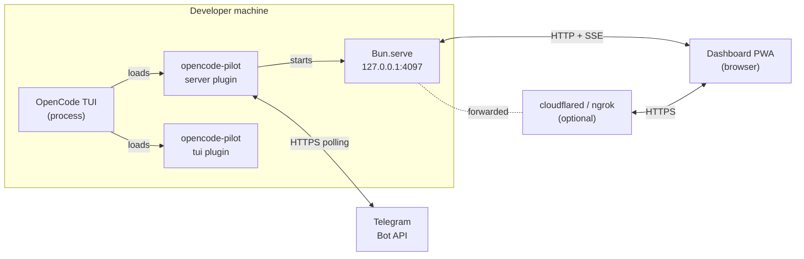
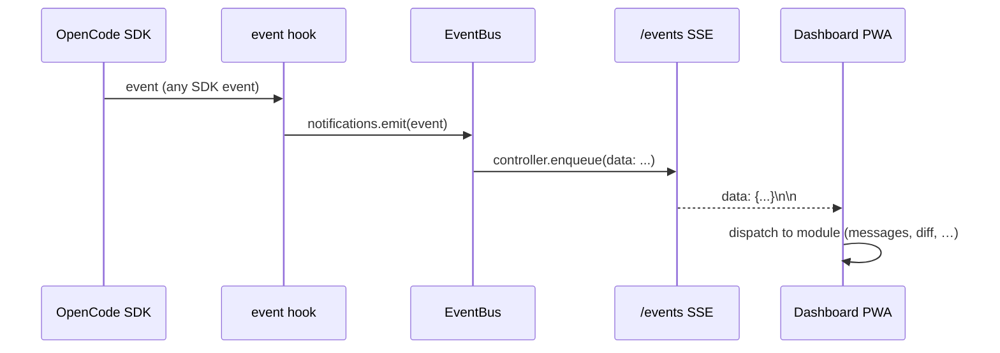
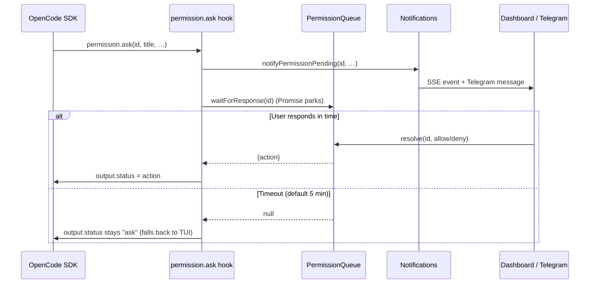
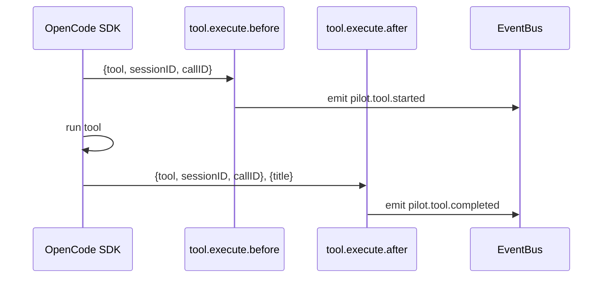

# Architecture

opencode-pilot is an OpenCode plugin that adds a remote-control layer on top
of the OpenCode SDK. It exposes sessions, prompts, permissions, and live
events over HTTP + Server-Sent Events so you can monitor and drive OpenCode
from a phone, another machine, or a public URL — without changing how
OpenCode itself works.

The plugin consists of two independent entry points, both wired up in the
same package:

- A **server plugin** that spins up `Bun.serve` on port 4097, serves a PWA
  dashboard, and registers OpenCode lifecycle hooks.
- A **TUI plugin** that adds slash commands to the OpenCode TUI and reacts
  to pilot events from the server plugin.

Everything is implemented with **factory functions** (`createEventBus`,
`createPermissionQueue`, etc.) — no classes. Dependencies are passed in at
construction time and the factory returns a small interface. This makes the
code easy to test and easy to reason about.

## System Diagram



- OpenCode loads both the server plugin and the TUI plugin from the same
  package.
- The server plugin owns `Bun.serve`, the event bus, the permission queue,
  the Telegram bot, and the tunnel lifecycle.
- The TUI plugin reads the state file written by the server plugin and
  subscribes to pilot events over the OpenCode event bus.
- The dashboard PWA is static HTML/JS/CSS served from the same `Bun.serve`
  instance — no separate web server.
- Telegram and tunnels are optional; if they fail to start, the plugin logs
  a warning and keeps running.

## Components

### Server plugin (`src/server/`)

| File | Responsibility |
|---|---|
| `index.ts` | Entry point. Wires every factory together, starts the HTTP server, writes the state file, writes the banner, installs hooks, registers graceful shutdown handlers. |
| `config.ts` | Parses env vars with `loadConfig` / `loadConfigSafe`. Throws `ConfigError` on invalid values; `loadConfigSafe` logs a warning and falls back to defaults. |
| `constants.ts` | Magic numbers in one place: `DEFAULT_PORT=4097`, `DEFAULT_HOST=127.0.0.1`, `DEFAULT_PERMISSION_TIMEOUT_MS=300_000`, `SSE_KEEPALIVE_INTERVAL_MS=25_000`, `BUN_SERVE_IDLE_TIMEOUT_SEC=255`. |
| `types.ts` | The `PilotEvent` discriminated union, `BusEvent` (pilot + SDK passthrough), and `PilotError` base class. |

### Hooks (`src/server/hooks/`)

OpenCode lifecycle callbacks that bridge the SDK to the pilot services.

- `event.ts` — `createEventHook`: receives every SDK event, forwards it to
  the SSE bus via `notifications.emit`, and inspects `session.status` /
  `session.error` to fire Telegram idle and error notifications.
- `permission.ask.ts` — `createPermissionAskHook`: when OpenCode asks for
  permission, it fires `pilot.permission.pending` on the bus, pushes a
  Telegram message, and parks on the permission queue. If a resolver
  answers before the timeout, the hook sets `output.status` to `allow` or
  `deny`. If nothing answers, control falls back to the TUI.
- `tool.ts` — `createToolHooks`: emits `pilot.tool.started` and
  `pilot.tool.completed` on `tool.execute.before` / `tool.execute.after`.

### HTTP (`src/server/http/`)

- `server.ts` — `createRemoteServer`: sets up `Bun.serve` with
  `idleTimeout: 255`, handles CORS preflight, dispatches to the route
  table, runs the auth middleware for `auth: "required"` routes.
- `routes.ts` — the route table. Each route has a regex pattern (with
  named capture groups for `:id` params), an `auth` requirement
  (`required` / `optional` / `none`), and a handler.
- `handlers.ts` — one function per route. Handlers receive a
  `RouteContext` (`req`, `url`, `params`, `deps`) and return a `Response`.
- `auth.ts` — `validateToken` checks `Authorization: Bearer <token>`,
  `getIP` extracts forwarded IP headers for the audit log.
- `cors.ts` — `CORS_HEADERS` constant and `corsPreflightResponse()`.
- `json.ts` — `json()` and `jsonError()` helpers with consistent CORS and
  error shape.

### Services (`src/server/services/`)

Small, independent factories. Most have no dependencies on each other —
they are composed in `index.ts`.

- `event-bus.ts` — `createEventBus`: in-memory SSE fanout. `emit(event)`
  broadcasts to all connected `ReadableStream` controllers. Dead clients
  (errored enqueue) are pruned. Every stream starts with a
  `pilot.connected` event and sends a `: ping\n\n` keepalive every 25 s.
- `permission-queue.ts` — `createPermissionQueue`: a map of
  `permissionID → resolver`. `waitForResponse(id)` returns a promise that
  resolves when `resolve(id, action)` is called, or to `null` after the
  configured timeout.
- `audit.ts` — `createAuditLog`: append-only JSON Lines file at
  `.opencode/pilot-audit.log`. Also mirrors each entry to `ctx.client.app.log`.
- `state.ts` — `writeState` / `readState` / `clearState` for the
  `.opencode/pilot-state.json` file. Consumed by the TUI plugin.
- `tunnel.ts` — `startTunnel`: spawns `cloudflared` or `ngrok` and scrapes
  stdout/stderr for the public URL. Returns `{publicUrl: null}` if the
  binary is missing or times out — never throws.
- `telegram.ts` — `createTelegramBot`: sends messages, requests
  permissions with inline buttons, and runs a `getUpdates` long-poll loop
  to receive `callback_query` presses that resolve the permission queue.
- `qr.ts` — wraps `qrcode-terminal` to render the banner QR.
- `banner.ts` — `writeBanner`: composes the ASCII banner (URL + token +
  QR + direct link + optional PWA deep-link) and writes it to
  `.opencode/pilot-banner.txt`.
- `notifications.ts` — `createNotificationService`: the unified pipeline.
  Every hook calls this instead of reaching into the bus, Telegram, or
  audit directly. Keeps fan-out logic in one place.

### Util (`src/server/util/`)

- `auth.ts` — `generateToken()` returns `crypto.randomBytes(32).toString("hex")`.
- `network.ts` — `getLocalIP()` picks the first non-loopback IPv4 address
  for the banner's LAN URL.

### Dashboard (`src/server/dashboard/`)

A static Progressive Web App served by the same `Bun.serve`. Split into
one file per concern so it stays readable without a bundler:

- `index.html` — shell, imports `main.js`, references `styles.css`.
- `main.js` — entry point, wires the modules together on load.
- `auth.js` — reads the token from the URL hash or prompts for it.
- `sse.js` — opens `EventSource` against `/events?token=…`.
- `api.js` — thin wrapper around `fetch` with the Bearer header.
- `state.js` — client-side state store (sessions, messages, diffs).
- `sessions.js`, `messages.js`, `multi-view.js`, `diff.js`,
  `permissions.js`, `markdown.js`, `settings.js`, `shortcuts.js`,
  `toast.js`, `connect.js` — one module per UI concern.
- `sw.js` + `manifest.json` + `icons/` — service worker + PWA manifest
  for offline caching and "Add to Home Screen".

### TUI plugin (`src/tui/`)

A single file (`index.ts`) that:

1. Registers two slash commands: `/remote-control` (aliases `/pilot`,
   `/rc`) and `/pilot-token`. Both read `.opencode/pilot-state.json` and
   show the banner or the raw token as a toast.
2. Subscribes to `pilot.permission.pending`, `pilot.client.connected`, and
   `pilot.client.disconnected` on the TUI event bus and shows a toast for
   each.

The TUI plugin does **not** import from `src/server/`. The two sides
communicate through the state file and the event bus — both owned by
OpenCode, not by this plugin.

## Data Flow

### 1. Event flow — OpenCode to the dashboard



Every SDK event is forwarded as-is, plus typed `pilot.*` events for
pilot-specific state transitions.

### 2. Permission flow



The queue is an in-memory `Map<permissionID, resolver>`. Telegram
callback presses and HTTP `POST /permissions/:id` both call the same
`resolve(id, action)` — any channel can answer.

### 3. Tool execution flow



These events let the dashboard render live "Running `bash: …`" chips and
mark them completed when the tool returns.

## Security Model

- **Auth token.** `crypto.randomBytes(32).toString("hex")` — 64 hex chars,
  generated at startup. Not persisted outside `.opencode/pilot-state.json`.
- **Bearer scheme.** Every `auth: "required"` route needs
  `Authorization: Bearer <token>`. The `/events` SSE endpoint also accepts
  `?token=<token>` as a query param because `EventSource` cannot set
  custom headers.
- **Localhost by default.** `PILOT_HOST=127.0.0.1`. The banner emits a
  warning when the host is localhost but a tunnel/LAN is expected.
- **Audit log.** Every authed request, every permission decision, every
  SSE connection is appended as JSON to `.opencode/pilot-audit.log`.
- **Permission timeout.** `PILOT_PERMISSION_TIMEOUT` (default 300 000 ms).
  When the queue times out, control falls back to the TUI — no silent
  approval.
- **Tunnel = public exposure.** When `PILOT_TUNNEL` is not `off`, the
  dashboard is reachable from the internet. The auth token is the only
  barrier. Rotate it by restarting OpenCode.
- **Path traversal.** The dashboard static-file handler rejects any path
  containing `..`.

## Event Types

Taken directly from `src/server/types.ts`:

```ts
export type PilotEvent =
  | { type: "pilot.connected"; properties: { timestamp: number } }
  | {
      type: "pilot.permission.pending"
      properties: {
        permissionID: string
        title: string
        sessionID: string
        permissionType: string
        pattern?: string | string[]
        metadata: Record<string, unknown>
      }
    }
  | {
      type: "pilot.permission.resolved"
      properties: {
        permissionID: string
        action: "allow" | "deny"
        source: "remote" | "telegram" | "tui"
      }
    }
  | {
      type: "pilot.tool.started"
      properties: { tool: string; sessionID: string; callID: string }
    }
  | {
      type: "pilot.tool.completed"
      properties: { tool: string; sessionID: string; callID: string; title: string }
    }
  | { type: "pilot.client.connected"; properties: { ip: string; timestamp: number } }
  | { type: "pilot.client.disconnected"; properties: { timestamp: number } }
```

Any SDK event flows through as `SdkEvent` (`{ type: string; properties: Record<string, unknown> }`).
The union of both is `BusEvent` — what `EventBus.emit` accepts.

## Route Table

| Method | Path | Auth |
|---|---|---|
| `GET` | `/` | none |
| `GET` | `/dashboard/*` | none |
| `GET` | `/*.{js,css,json,svg,png,ico,woff,woff2,ttf}` | none |
| `GET` | `/{icons,assets}/*.{js,css,json,svg,png,ico,woff,woff2,ttf}` | none |
| `GET` | `/status` | required |
| `GET` | `/sessions` | required |
| `POST` | `/sessions` | required |
| `GET` | `/sessions/:id` | required |
| `GET` | `/sessions/:id/messages` | required |
| `GET` | `/sessions/:id/diff` | required |
| `POST` | `/sessions/:id/prompt` | required |
| `POST` | `/sessions/:id/abort` | required |
| `GET` | `/permissions` | required |
| `POST` | `/permissions/:id` | required |
| `GET` | `/events` | optional (Bearer header or `?token=`) |
| `GET` | `/tools` | required |
| `GET` | `/project` | required |

Order in the route array matters only where patterns could overlap — more
specific routes come first. See `src/server/http/routes.ts` for the full
ordered table.

## Extending

### Add a new pilot event type

1. Add a variant to the `PilotEvent` union in `src/server/types.ts`.
2. Emit it from the relevant hook or service via
   `notifications.emitPilot({ type: "...", properties: {...} })`.
3. Handle it in `src/server/dashboard/sse.js` (dispatch to a module).
4. Handle it in `src/tui/index.ts` if the TUI should react too.

### Add a new HTTP route

1. Add the handler function to `src/server/http/handlers.ts`. Use the
   existing `RouteContext` shape and return a `Response` via the `json`
   / `jsonError` helpers.
2. Register it in the `routes` array in `src/server/http/routes.ts` with
   its regex pattern and auth requirement.
3. Add the route to the table in `CLAUDE.md` and the top-level
   `README.md`.
4. If the route mutates state, call `deps.audit.log(action, details)` so
   the operation shows up in the audit log.

### Add a new notification channel

To add, say, Slack or Discord alongside Telegram:

1. Create `src/server/services/slack.ts` with a `createSlackBot` factory
   exposing the methods the pipeline needs (`sendMessage`,
   `sendPermissionRequest`, `sendStartup`, `stop`).
2. Instantiate it in `src/server/index.ts` and pass it to
   `createNotificationService`.
3. Keep the "silently disabled when config is missing" pattern — every
   channel should no-op when env vars are absent instead of throwing.
